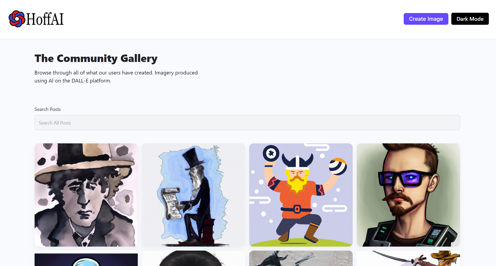

  

## Index

1. [Description](#description)
3. [Usage](#usage)
4. [Technology](#technology)
4. [Preview](#preview)
4. [Installation](#installation)
6. [Contributing](#contributing)
7. [Resources](#resources)
8. [License](#license)

## Description

This is an AI image generator. App responds to user prompts creating one of a kind photos and artwork. Download or save with the community. 

## Usage

The homepage of this site is the community page where users can see all the photos that others have shared. Browse through the photos or use the searchbar at the top to look for certain types of images. Hover over the images to see who the creator was, the prompt used and an option to download the image. 

To create images click the 'create image' button in the upper right habd corner to take to the rendering page. There user will be promted to enter their screenname and enter a prompt for the image they would like to be rendered. Once the image comes back from the AI, user can then choose to save their image with the community. 

## Technology

1. `React:`
2. `Git/Github:` Repo and version management.
3. `TailwindCss`: For most of the CSS styling.
4. `OpenAI, DALL-E`: API used to render the image
5. `Hostinger`: Deployment.
6. NPM Packages: `React-Bootstrap`, `Mongoose`
7. `Vite`: React build.
8. `Cloudinary`: Images for community saved to cloudinary cloud to persist long term. 

## Preview

  
 

## Installation

Setup: 
- (1) Fork the repo, (2) Clone the forked repo locally, (3) Run "npm install" (to install the dependencies), (5) Launch Server = "npm run dev".

- User will need to setup a .env file with the following variable OPENAI_API_KEY, CLOUDINARY_CLOUD_NAME, CLOUDINARY_API_KEY,CLOUDINARY_API_SECRET. So accounts to Cloudinary and OpenAi will be necessary to make this project work. 

## Contributing

Contributor Covenant Code of Conduct

## Resources

1. GitHub Repo: <https://github.com/Hoffalypse/AI-Photo-Booth>
2. Hostinger Deploy: <https://www.hoffai.com/> 

## License

This project is licensed under the terms of the The MIT License. Please click on the license badge for more information.